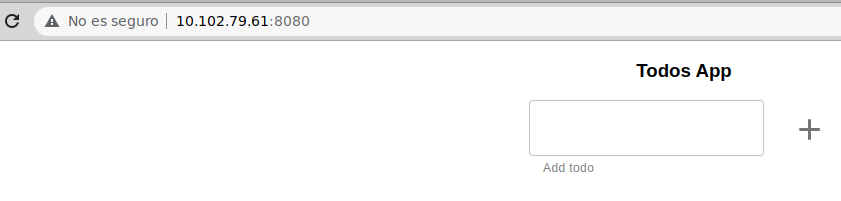
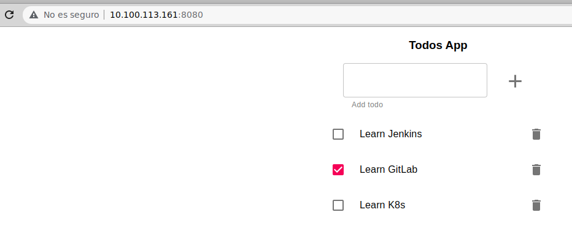
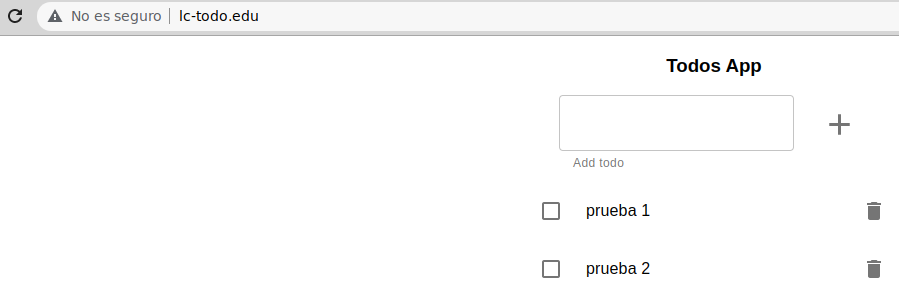
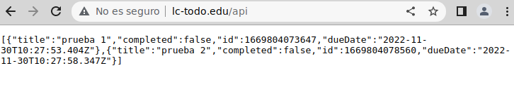

### Ejercicio 1 de Kubernetes

Tras comprobar que la aplicación funciona en local se ha creado la imagen de *Docker* y se ha subido a *DockerHub* de la siguiente forma:

```
docker build -t demcorp/lc-todo-monolith .
docker push demcorp/lc-todo-monolith
```

Para poder completar el ejercicio y lanzar la aplicación en *minikube* se han creado los ficheros:

- `00-monolith-in-mem/01-namespace.yaml`
- `00-monolith-in-mem/02-deployment.yaml`
- `00-monolith-in-mem/03-service.yaml`

  *NOTA*: Se ha creado el *namespace* **ejercicio1** para la ejecución de los ficheros

Para aplicar los ficheros se ha usado el siguiente comando *kubectl*:

```
kubectl apply -f 00-monolith-in-mem
```

Tras aplicar los ficheros, y usar la opción de `minikube tunnel`, se crea el *pod* y el *servicio* necesarios:

```
$ kubectl get pods -n ejercicio1
NAME                        READY   STATUS    RESTARTS   AGE
todo-app-5d7c95cc85-lv4rm   1/1     Running   0          30s

$ kubectl get endpoints -n ejercicio1
NAME       ENDPOINTS         AGE
todo-app   172.17.0.7:3000   5m55s

$ kubectl get svc -n ejercicio1
NAME       TYPE           CLUSTER-IP     EXTERNAL-IP    PORT(S)          AGE
todo-app   LoadBalancer   10.102.79.61   10.102.79.61   8080:30272/TCP   12m
```

Al conectar, desde un navegador, a la URL http://10.102.79.61:8080/ aparece la aplicación correctamente:




### Ejercicio 2 de Kubernetes

Tras comprobar que la aplicación funciona en local se ha creado la imagen de *Docker* y se ha subido a *DockerHub* de la siguiente forma:

```
docker build -t demcorp/lc-todo-frontend-monolith .
docker push demcorp/lc-todo-frontend-monolith
```

Para poder completar el ejercicio y lanzar la aplicación en *minikube* se han creado los ficheros:

- `01-monolith/01-namespace.yaml`
- `01-monolith/02-configmaps.yaml` -> se definen los ConfigMaps de data y de app
- `01-monolith/03-storageclass.yaml`
- `01-monolith/04-persistentvolume.yaml`
- `01-monolith/05-persistentvolumeclaim.yaml`
- `01-monolith/06-servicedata.yaml`
- `01-monolith/07-statefulset.yaml`
- `01-monolith/08-deployment.yaml`
- `01-monolith/09-serviceapp.yaml`

  *NOTA*: Se ha creado el *namespace* **ejercicio2** para la ejecución de los ficheros
  *NOTA2*: Se ha usado la DNS del servicio de data (svc-todo-data.ejercicio2.svc.cluster.local) para DB_HOST

Primero se han aplicado, con *kubectl*, los ficheros pertenecientes a la base de datos:

```
kubectl apply -f "01-monolith/0[1-7]*.yaml"
```

Se comprueba que se han creado los objetos correctamente:

```
$ kubectl get sc -n ejercicio2
NAME                 PROVISIONER                RECLAIMPOLICY   VOLUMEBINDINGMODE   ALLOWVOLUMEEXPANSION   AGE
standard (default)   k8s.io/minikube-hostpath   Delete          Immediate           false                  39d
storagepostgres      k8s.io/minikube-hostpath   Delete          Immediate           false                  8s

$ kubectl get pv -n ejercicio2
NAME   CAPACITY   ACCESS MODES   RECLAIM POLICY   STATUS   CLAIM              STORAGECLASS      REASON   AGE
pvpg   1Gi        RWO            Recycle          Bound    ejercicio2/pvcpg   storagepostgres            23s

$ kubectl get pvc -n ejercicio2
NAME    STATUS   VOLUME   CAPACITY   ACCESS MODES   STORAGECLASS      AGE
pvcpg   Bound    pvpg     1Gi        RWO            storagepostgres   37s

$ kubectl get svc -n ejercicio2
NAME            TYPE           CLUSTER-IP       EXTERNAL-IP    PORT(S)          AGE
svc-todo-data   ClusterIP      10.109.108.157   <none>         5432/TCP         56s

$ kubectl get pods -n ejercicio2
NAME                       READY   STATUS    RESTARTS   AGE
todo-data-0                1/1     Running   0          78s

$ kubectl get endpoints -n ejercicio2
NAME            ENDPOINTS         AGE
svc-todo-data   172.17.0.6:5432   95s
```

Después se han insertado los datos (*todos_db.sql*) como se indica en el ejercicio y, posteriormente, se han aplicado los ficheros pertenecientes a la app:

```
kubectl apply -f "01-monolith/0[8-9]*.yaml"
```

Se comprueba que se han creado el *pod* y el *servicio* de la app (se excluyen los ya mostrados):

```
$ kubectl get pods -n ejercicio2
NAME                       READY   STATUS    RESTARTS   AGE
todo-app-f675889bb-w5mxk   1/1     Running   0          61s

$ kubectl get svc -n ejercicio2
NAME            TYPE           CLUSTER-IP       EXTERNAL-IP      PORT(S)          AGE
svc-todo-app    LoadBalancer   10.100.113.161   10.100.113.161   8080:32760/TCP   93s

$ kubectl get endpoints -n ejercicio2
NAME            ENDPOINTS         AGE
svc-todo-app    172.17.0.8:3000   110s
```

Al conectar, desde un navegador, a la URL http://10.100.113.161:8080/ aparece la aplicación correctamente:




### Ejercicio 3 de Kubernetes

Tras comprobar que la aplicación funciona en local se han creado la imágenes de *Docker* y se han subido a *DockerHub* de la siguiente forma:

```
cd todo-api
docker build -t demcorp/lc-todo-api-distributed .
cd ../todo-front
docker build -t demcorp/lc-todo-front-distributed .
docker push demcorp/lc-todo-api-distributed
docker push demcorp/lc-todo-front-distributed
```

Para poder completar el ejercicio y lanzar la aplicación en *minikube* se han creado los ficheros:

- `02-distributed/01-namespace.yaml`
- `02-distributed/02-deploymentfront.yaml`
- `02-distributed/03-servicefront.yaml`
- `02-distributed/04-configmap.yaml`
- `02-distributed/05-deploymentapi.yaml`
- `02-distributed/06-serviceapi.yaml`
- `02-distributed/07-ingress.yaml`

  *NOTA*: Se ha creado el *namespace* **ejercicio3** para la ejecución de los ficheros

Antes de aplicar los ficheros, se ha habilitado el *Ingress controller* usando la referencia que se indica en el ejercicio:

```
minikube addons enable ingress
```

Para aplicar los ficheros se ha usado el siguiente comando *kubectl*:

```
kubectl apply -f 02-distributed
```

Una vez aplicados los ficheros se comprueba que se han creado los *pods*, *servicios* e *ingress*:

```
$ kubectl get pods -n ejercicio3
NAME                         READY   STATUS    RESTARTS   AGE
todo-api-767c66c498-wqdqm    1/1     Running   0          100s
todo-front-c57699bd7-tl2nc   1/1     Running   0          100s

$ kubectl get svc -n ejercicio3
NAME             TYPE        CLUSTER-IP      EXTERNAL-IP   PORT(S)    AGE
svc-todo-api     ClusterIP   10.111.144.39   <none>        3000/TCP   2m49s
svc-todo-front   ClusterIP   10.97.40.3      <none>        80/TCP     2m49s

$ kubectl get endpoints -n ejercicio3
NAME             ENDPOINTS         AGE
svc-todo-api     172.17.0.7:3000   3m26s
svc-todo-front   172.17.0.6:80     3m26s

$ kubectl get ingress -n ejercicio3
NAME          CLASS   HOSTS         ADDRESS        PORTS   AGE
distributed   nginx   lc-todo.edu   192.168.49.2   80      3m47s
```

Para poder realizar la prueba desde un navegador es necesario incluir lo siguiente en el fichero */etc/hosts* del sistema:

```
192.168.49.2 lc-todo.edu
```

Después del cambio se puede navegar a los dos recursos que se han definido (`/` y `/api`). Se incluyen algunos datos de prueba:




